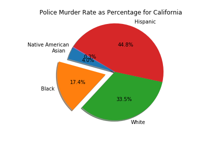

# Police Killings by state demographics project

Police brutality of minority groups, especially the black community in America has lead to protests and riots all over the world in 2020. 
This notebook uses the police brutality dataset and a population dataset for race in each state to compare the numbers 
and identify states where police killings happen more frequently to minorities. 
First the dataset is imported and a pie chart to compare percentage of killings by race:

## e.g.:

Next the population dataset is imported and a comparison of the pie chart with an equivalent pie chart for population percentage. The top 5 states with the biggest
difference in percentage are displayed in the program. Examples are shown below:

Finally a graph depicting the police killings per 100,000 for each demographic:

Please see the Police_killings.py file for the full code.
